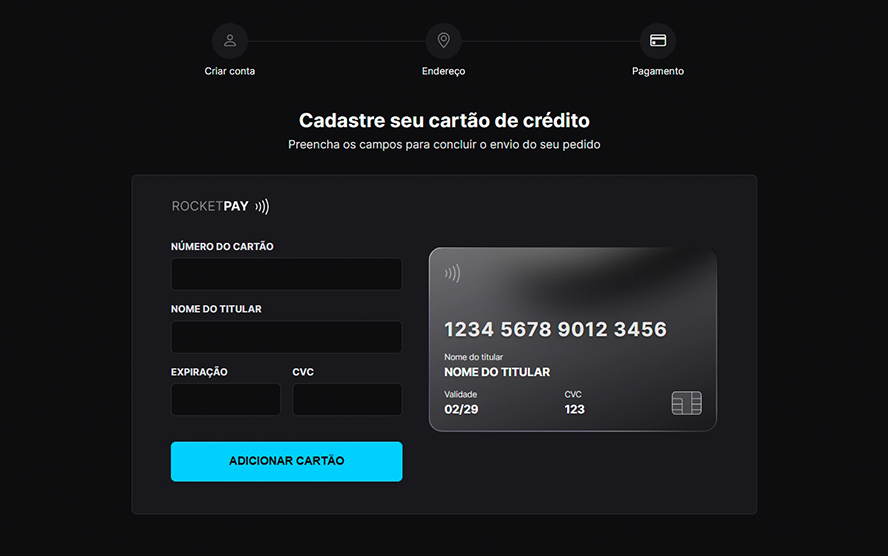

<h1 align="center"> Rocketpay </h1>

<h3 align="center">
Página de pagamento com cartão de crédito, com várias interações!
</h3>

 

  <a href="#visao">Projeto</a>&nbsp;&nbsp;&nbsp;|&nbsp;&nbsp;&nbsp;
  <a href="#leng">Tecnologias</a>&nbsp;&nbsp;&nbsp;|&nbsp;&nbsp;&nbsp;
  <a href="#contato">Contato</a>

 

<h1>Visão geral</h1>
 Projeto desenvolvido para portifólio pessoal, muito comum em sites de <strong>e-commerce</strong>, onde é possível pagar com cartão de crédito. A página possui interações bem legais, ao digitar os dados, eles <strong>atualizam em tempo real</strong> como um tamplate de cartão de crédito ao lado do formulário, e mais... Foi utilizado expressão regular(<strong>Regex</strong>) e a biblioteca <strong>IMask</strong> que <strong>identificam qual a bandeira do cartão utilizado</strong> e o layout se adapta automaticamente, teste no link abaixo.

 

<h3 align="center">
<a href="https://rocketpay-azure.vercel.app/" target="_blank">Testar (preview)</a> 
 
 
</h3>

  

<!-- 

  

 -->
 

<h1>Tecnologias</h1>

 
  

  <!--  -->

 
 
 

<h1>Como entro em contato?</h1>

Entre em contato através dos links a seguir!
 
 

 
 
 
